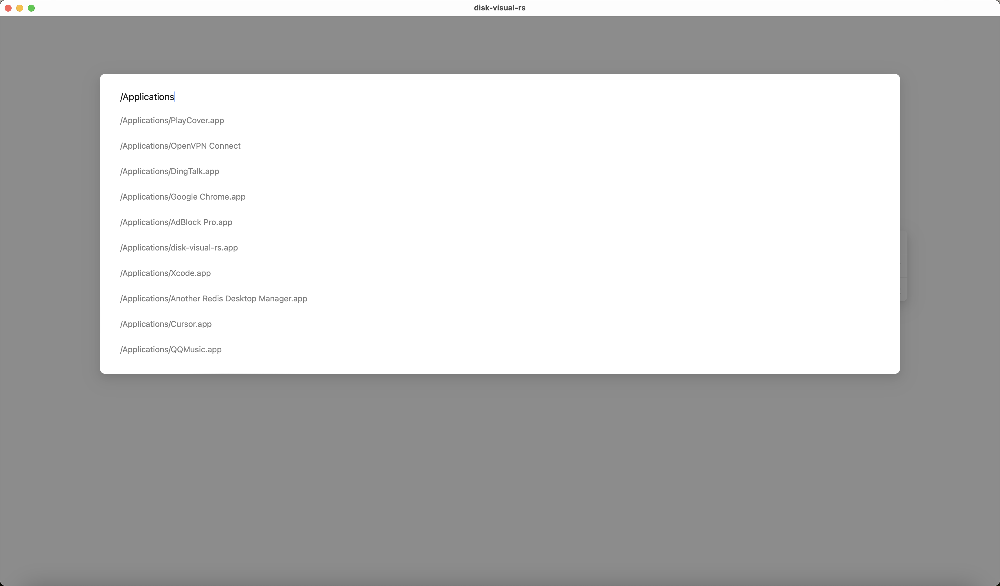

# Disk Visual RS

Disk Visual RS is a simple disk visualization tool developed using Rust, Vue, Tauri, and echarts. This tool aims to help you clearly understand disk usage and space distribution.

## Features
- Simple to operate
- Visual interface with real-time updates
- Cross-platform compatibility

## Getting Started

### Installation

- Download the latest version of Disk Visual RS from the [Release](https://github.com/ZichunYang/disk-visual-rs/releases) page.

or

- Compile the source code yourself:
    - First, install [Rust](https://www.rust-lang.org/) and [Node.js](https://nodejs.org/en)
    - Next, open the terminal and run the following command to install yarn:
      ```
      npm install -g yarn
      ```
    - Then, run the following command to install the project dependencies:
      ```
      yarn install
      ```
    - Finally, you can choose to run one of the following commands to start the project:
      ```
      yarn tauri dev
      ```
      or
      ```
      yarn tauri build
      ```
## Effects



## Feedback and Support
If you encounter any issues or have any suggestions, please leave a message on our [GitHub Issues](https://github.com/ZichunYang/disk-visual-rs/issues) page.

## License
This project is licensed under the MIT License.
