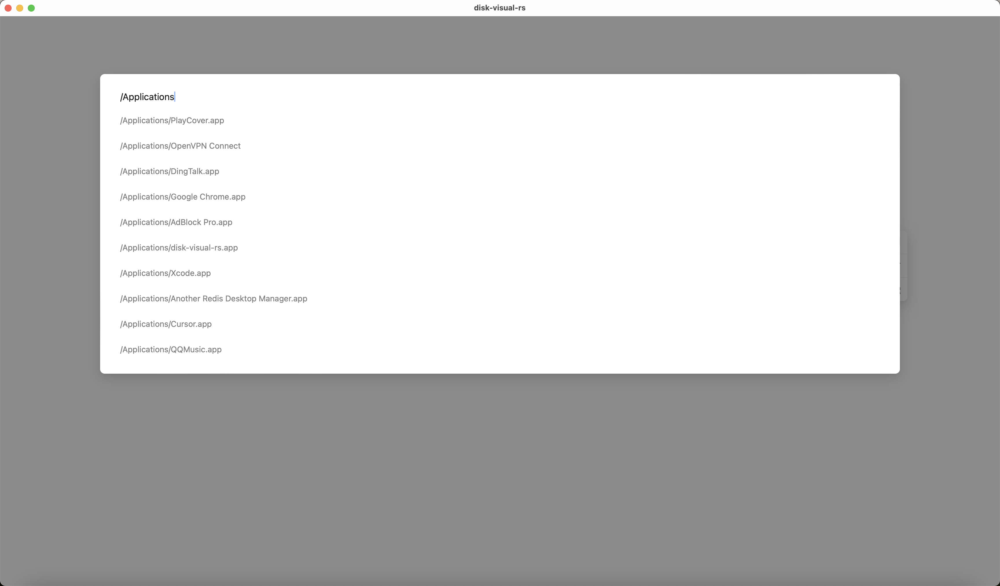
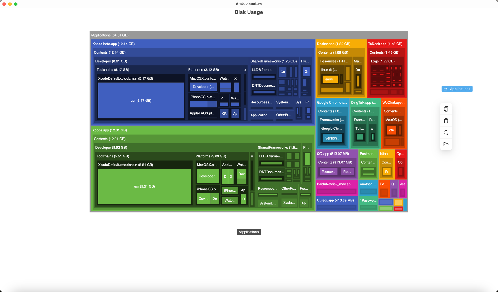

# Disk Visual RS

Disk Visual RS是一个简易的磁盘可视化工具，它使用Rust、Vue、Tauri、echarts开发。本工具旨在帮助您清晰地了解磁盘使用情况和空间分布。

## 特点
- 简易操作
- 可视化界面、实时更新
- 跨平台

## 开始使用

### 安装

- 从[Release](https://github.com/ZichunYang/disk-visual-rs/releases)页面下载最新版本的Disk Visual RS。

或

- 自行编译源代码：
    - 首先，安装[Rust](https://www.rust-lang.org/)和[Node.js](https://nodejs.org/en)
    - 然后，打开终端并运行以下命令来安装yarn：
      ```
      npm install -g yarn
      ```
    - 接着，运行以下命令来安装项目依赖：
      ```
      yarn install
      ```
    - 最后，您可以选择运行以下命令之一来启动项目：
      ```
      yarn tauri dev
      ```
      或
      ```
      yarn tauri build
      ```
## 效果



## 反馈与支持
如果您遇到任何问题或有任何建议，请在我们的[GitHub Issues](https://github.com/ZichunYang/disk-visual-rs/issues)页面留言。

## 许可
本项目根据MIT许可证进行许可。
